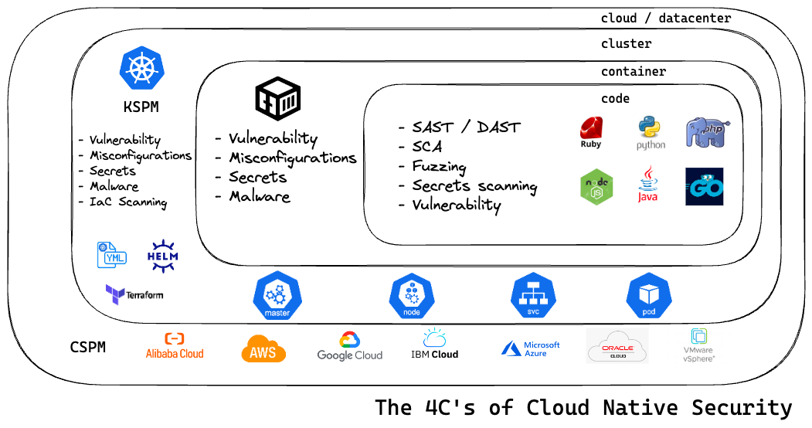
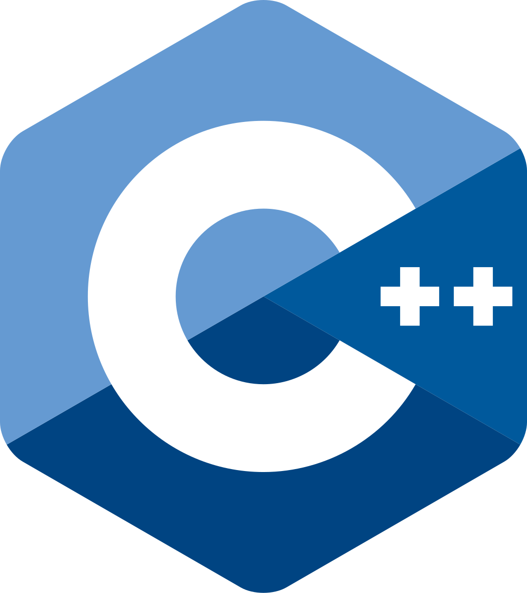

<h1 align="left">
    Hi there, I'm <a href="https://www.linkedin.com/in/roman-grewal-99907b377" target="_blank">Roman Grewal</a>⚡
</h1>

  

<h3 align="center">
A Penetration Tester 🤖 living in Baltimore, MD 🇺🇸
</h3>

### 😄 About me:
- 👨‍💻 Writing code since April of 2013.
- 👀 Hacking is an obsession.
- 🍒 Code is beautiful.
    
### 🔭 What I’m currently working on:
#### 🔠 Application Penetration Testing
- ✅ Web Apps
- ✅ Manual Penetration Testing / Lightweight DAST
- ✅ Manual & Automated SAST
- ✅ SCA
#### 🌐 Penetration Testing of Kubernetes Deployments

#### ☁️ Penetration Testing of Cloud Environments

    
    
    

### 🗣️ Connect with me:

    
    
    
    
    

### 🧰 Github Metrics:

### :zap: Recent Activity:

<!--RECENT_ACTIVITY:start-->
1. ⬆️ Pushed 1 commit(s) to [romangrewal/romangrewal](https://github.com/romangrewal/romangrewal) 
2. ⬆️ Pushed 1 commit(s) to [romangrewal/webapp-pentesting-lab](https://github.com/romangrewal/webapp-pentesting-lab) 
3. ⬆️ Pushed 1 commit(s) to [romangrewal/webapp-pentesting-lab](https://github.com/romangrewal/webapp-pentesting-lab) 
4. ⬆️ Pushed 3 commit(s) to [romangrewal/webapp-pentesting-lab](https://github.com/romangrewal/webapp-pentesting-lab) 
5. ❌ Closed PR [#2](https://github.com/romangrewal/webapp-pentesting-lab/pull/2) in [romangrewal/webapp-pentesting-lab](https://github.com/romangrewal/webapp-pentesting-lab) 
<!--RECENT_ACTIVITY:end-->

### 🔦 Penetration Testing Tools:

    
    
    

### 🏗️ DevOps Tools:

    
    
     
    

     
     
     
    

### 🌿 Current Dev Environment:

    
    

### 🧑‍💻 What I use to write code:

    

### 🦖 Databases I work with (SQL & NoSQL):

     
     
     
     

     

### 📺 Well versed in Web to Video Live Streaming:
- [Transports for WebRTC](https://datatracker.ietf.org/doc/html/rfc8835)
- [RTP: A Transport Protocol for Real-Time Applications](https://datatracker.ietf.org/doc/html/rfc3550)
- [Interactive Connectivity Establishment (ICE): A Protocol for Network Address Translator (NAT) Traversal](https://datatracker.ietf.org/doc/html/rfc8445)
- [Session Traversal Utilities for NAT (STUN)](https://datatracker.ietf.org/doc/html/rfc8489)
- [Traversal Using Relays around NAT (TURN): Relay Extensions to Session Traversal Utilities for NAT (STUN)](https://datatracker.ietf.org/doc/html/rfc5766)
- [Real-Time Streaming Protocol Version 2.0](https://datatracker.ietf.org/doc/html/rfc7826)
- [HTTP Live Streaming](https://datatracker.ietf.org/doc/html/rfc8216)
- [Janus Video Server](https://janus.conf.meetecho.com)

### 📫 You can contact me through [LinkedIn](https://www.linkedin.com/in/roman-grewal-99907b377)

Welcome to my GitHub profile!  
Please feel free to clone/fork projects, raise issues and submit PRs if you think something could be better.  
Ask me anything <a href="https://github.com/romangrewal/romangrewal/issues/new"><b>here</b></a> 
or <a href="https://www.linkedin.com/in/roman-grewal-99907b377"><b>LinkedIn</b></a>   

<i>Happy Hacking!</i> 🕶️

### ‼️ Favorite Tools:
#### 💯 Programming Languages:

     
    
     
    

     
     

#### 🐧 Linux Distributions:

     
     
     
     

     

<!-- 
Honorable Mentions:
Windows
OSX
Android
Kafka
NIST SP 800-53
-->

#### 🪟 Window Manager:

     

