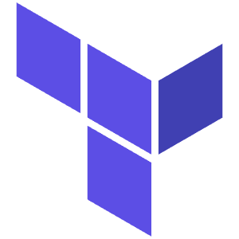

<h1 align="left">
    Hi there, I'm <a href="https://www.linkedin.com/in/roman-grewal-99907b377/" target="_blank">Roman Grewal</a>⚡
</h1>

  

<h3 align="center">
A Penetration Tester 🤖 living in Baltimore, MD 🇺🇸
</h3>

### 😄 About me:
- Software Engineer & Penetration Tester
- I automate for breadth and manually test for depth
  
### 🔭 What I’m currently working on:
#### 🔠 Application Penetration Testing
- ✅ Web Apps
- ✅ Manual Penetration Testing / Lightweight DAST
- ✅ Manual & Automated SAST
- ✅ SCA
#### 🌐 Penetration Testing of Kubernetes Deployments

#### ☁️ Penetration Testing of Cloud Environments

    
    
    

### 🗣️ Connect with me:
### 🔦 Penetration Testing Tools:
- Burp Suite, Wireshark, Tcpdump

### 💯 Favorite Programming Languages:

     
     
     
     
     
     

### 🐧 Favorite Linux Distributions:

     
     
     
     
     

### 🪟 Favorite Window Manager:

     

### 🏗️ DevOps Tools:

    
    
     
    
     
     
     
    

### 🌿 Current Dev Environment:

    
    

### 🧑‍💻 What I use to write code:

    

### 🦖 Databases I work with (SQL & NoSQL):
- Postgres, MongoDB, Cassandra, HBase, Redis
### 📺 Well versed in WebRTC:
- RTP, Janus Video Server, STUN & TURN protocols
### 📫 You can contact me through LinkedIn
- Closing
